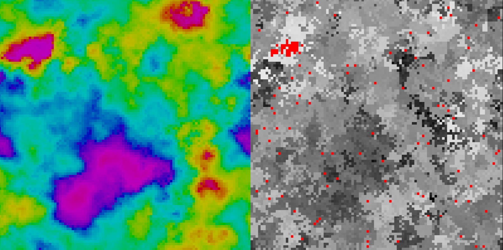

# Nannou Daisy World 

This is a project to play around with Nannou, the creative coding framework for Rust. It implements a 2D version of Daisy World, a model of Biosphere and Ecosphere coupling devised by James Lovelock. 

## Daisy World 



Daisy World takes place on a planet that has only one species of life, a Daisy. Daises have one genetic trait, their albedo, which determines who dark or light the Daisy is. This in turn determines how much sunlight the daises absorb and reflect. 

In the absence of Daises, a barren version of the planet reaches an equilibrium temperature of 295.5 Klein. If a region of the planet has an abundance of lighter daises, they reflect more of the suns light back in to space cooling that region down. Conversely if an area contains darker daises, they absorb more of the suns light and reradiate it to the atmosphere, raising the temperature there.

Each Daisy is born and lives out their lives for some time and dies each turn with a fixed probability. At the next turn, a empty piece of land can be birth a new daisy if it has a live neighbor. This birth happens with a probability that is some function of the local temperature.

Initially we take this birth function to be a normal distribution centered on T=295.5K.

## Running the application 

To run the application, simply run 

```bash 
cargo run --release
```

From the command line.

## To Do 

- [ ] Implement a UI so that different parameters can be controlled 
- [ ] Attempt to run the dispersion equation calculation on the GPU using a Vulkano shader
- [ ] Write a version that will run in the browser using web assembly 
- [ ] Abstract the different fields to be able to implement different 
- [ ] Write a stats module to record and display different stats about the simulation. 

